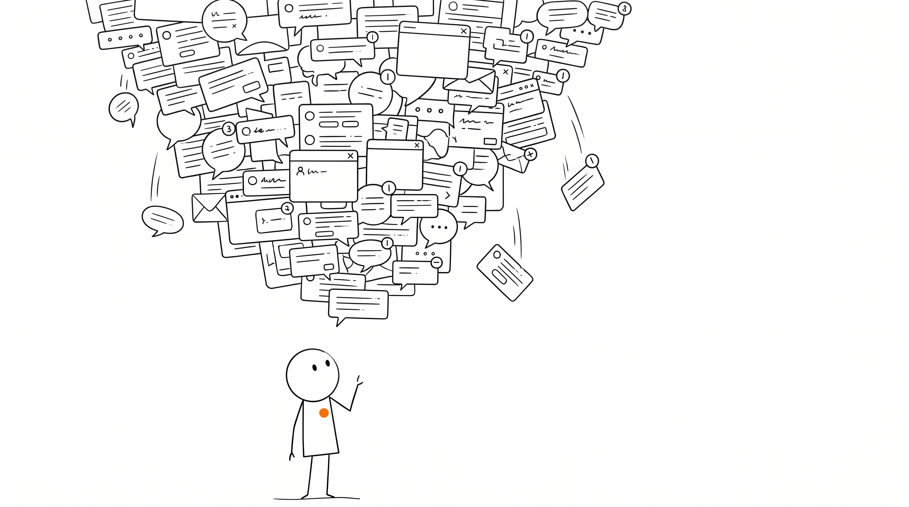
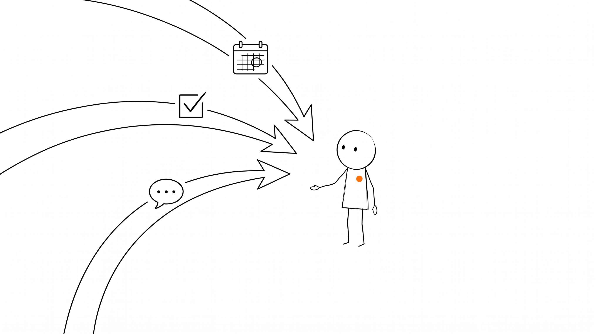
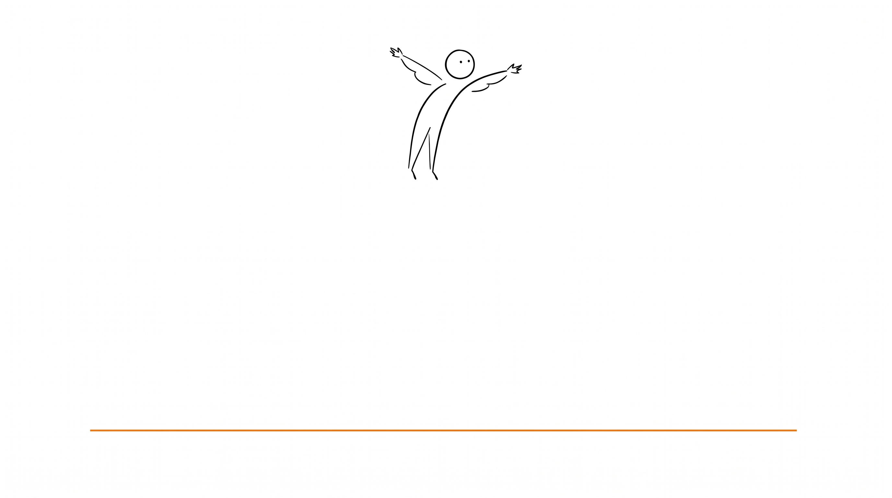

# Orange Line Illustration · 橙线插画

[中文](README.md) | **English**

> One idea, one accent, lots of silence.

A complete illustration style system (packaged as an AI agent **skill**) for
generating New Yorker-style minimalist editorial illustrations: thin black ink
lines on pure white, generous negative space, a single warm orange accent
(`#F97316`) — always placed on the most meaningful element.

Two workflows:
- **Single illustrations** — conceptual editorial images for articles, principles, covers
- **PPT slide decks** — turn articles/outlines into illustrated HTML presentations


---

## Character IP System

Three reusable character IPs, each with a fixed visual form and personality.

### 小橙 / Xiao Cheng (default character)

A geometric line-drawn figure with an orange dot on its chest. Quiet, focused, does the work.

- Circle head (outline only) + two dot eyes + no mouth
- Narrow rectangular body outline + thin stick limbs
- Single orange dot `#F97316` on chest = the entire image's accent color
- Must participate in the core action, never just decoration

| Info Overload | Tasks Find You |
|---|---|
|  |  |

### 线人 / Xian Ren (line-person)

Minimal abstract human — circle head + single arc body + single-line limbs. The fewest strokes that say "someone is here."

| The Swift Never Lands |
|---|
|  |

### 线猫 / Xian Mao (line-cat)

A kitten drawn in 10–12 strokes — open arcs, two dot eyes, two ear-strokes. The viewer's brain fills in the rest.

| Schrödinger's User |
|---|
|  |

---

## Style Rules (quick reference)

- **Line**: thin black ink, hand-drawn wobble, not mechanical
- **Background**: pure white — no texture, no gradients, no shadows
- **Accent**: one warm orange `#F97316`, placed on the single most meaningful element
- **Figures**: TINY. Objects are monumental, people are small. This imbalance is the signature drama.
- **Mood**: witty, restrained, intelligent

See `SKILL.md` and `references/` for the full specification.

---

## Two Workflows

### Workflow A: Single Concept Illustration

Generate a 16:9 editorial image for a judgment, principle, or metaphor in an article.

```
Generate three orange-line illustrations for this article
```

Flow: extract metaphor → design scene → generate candidates → human picks

### Workflow B: PPT Slide Deck

Turn an article/outline into an illustrated HTML slide deck, one scene per slide.

```
Turn this article into an orange-line PPT
```

Flow: read article → write slide outline → confirm → batch-generate illustrations → user picks → output HTML

See `references/ppt-workflow.md` for details.

---

## What's Inside

```
.
├── SKILL.md                          # Main spec: style, metaphor method, prompt template
├── references/
│   ├── xiao-orange-ip.md             # 小橙 character definition
│   ├── xiao-orange-prompt-template.md # 小橙 prompt template
│   ├── xianren-ip.md                 # 线人 character definition
│   ├── xianmao-ip.md                 # 线猫 character definition
│   └── ppt-workflow.md               # PPT slide deck workflow
├── examples/                         # Example images
├── LICENSE.md
└── README.md
```

## Installation

Works with any AI agent that supports the SKILL.md convention (Cola, Claude Code, Codex, etc.). Drop the directory into your agent's skills folder:

```bash
# Cola
~/.cola/skills/orange-line-illustration/

# Claude Code
~/.claude/skills/orange-line-illustration/
```

Then tell your agent — "generate three orange-line illustrations for this article" or "turn this article into an orange-line PPT" — and it follows the spec.

## License

**Dual license**: free for open-source & personal use; commercial license required for closed-source/proprietary use. See [LICENSE.md](LICENSE.md).
